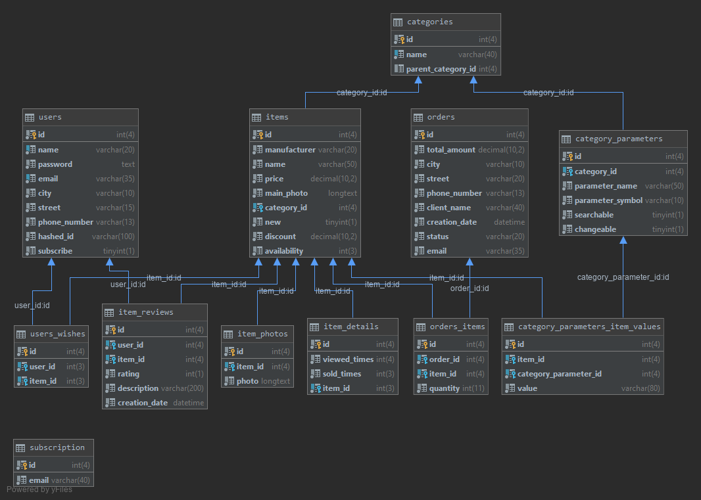

# TechStore
Online shop of digital products.

# Technologies
This is education project which uses next technologies:
1) JPA (JDBC in older commits);
2) Tomcat Server;
3) Servlets;
4) JSP and JSTL.

# Database
Server: MySQL 8

On the next screen you can see database relationships.

